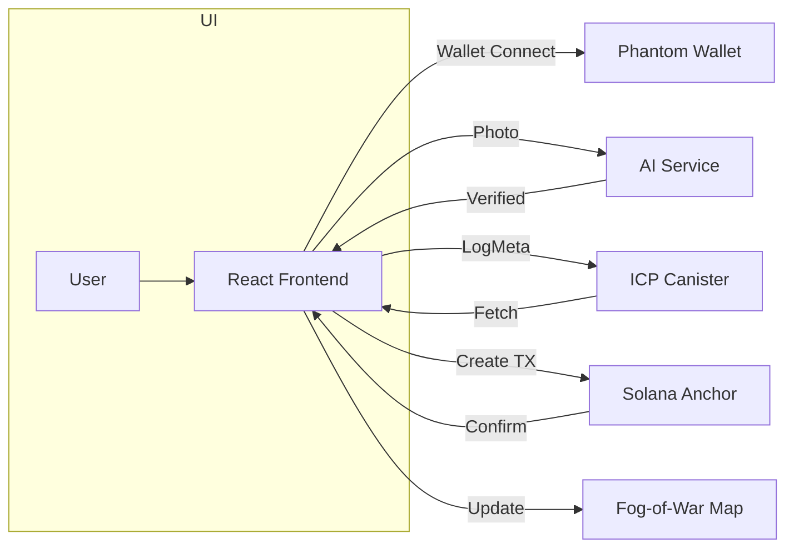

# PhantomFog

**Version:** 1.1.0  
**Team:** MAJKL  
**Event:** BrunelHack 2025

## Table of Contents
1. [Introduction](#introduction)
2. [Project Vision & Objectives](#project-vision--objectives)
   - [Vision](#vision)
   - [Core Objectives](#core-objectives)
   - [Success Metrics](#success-metrics)
3. [User Personas & Use Cases](#user-personas--use-cases)
4. [System Overview & Architecture](#system-overview--architecture)
5. [Frontend Design & Implementation](#frontend-design--implementation)
   - [Tech Stack](#tech-stack)
   - [Component Structure](#component-structure)
   - [Key Logic](#key-logic)
   - [Code Snippet: Fog Mask](#code-snippet-fog-mask)
6. [Backend & API Layer](#backend--api-layer)
   - [Endpoints](#endpoints)
   - [Middleware](#middleware)
7. [Blockchain Components](#blockchain-components)
   - [Solana Anchor Program](#solana-anchor-program)
   - [Internet Computer (ICP) Canister](#internet-computer-icp-canister)
8. [AI-Based Verification Flow](#ai-based-verification-flow)
9. [Data Models & Schemas](#data-models--schemas)
10. [Security & Privacy Considerations](#security--privacy-considerations)
11. [Performance & Scalability](#performance--scalability)
12. [Deployment & DevOps](#deployment--devops)
13. [Testing Strategy](#testing-strategy)
14. [Monitoring & Analytics](#monitoring--analytics)
15. [User Interface & Experience](#user-interface--experience)
16. [Internationalization & Localization](#internationalization--localization)
17. [Accessibility](#accessibility)
18. [Error Handling & Logging](#error-handling--logging)
19. [Developer Experience & Documentation](#developer-experience--documentation)
20. [Future Roadmap](#future-roadmap)
21. [Glossary](#glossary)
22. [References & Resources](#references--resources)

<a id="introduction"></a>
## Introduction
PhantomFog is a next-generation, gamified location verification platform that overlays a dynamic fog-of-war on an SVG London Tube map. Developed by Team MAJKL for BrunelHack 2025, PhantomFog leverages blockchain (Solana) and decentralized compute/storage (ICP) alongside AI-driven photo verification for a secure, privacy-preserving, and engaging experience.

Users physically visit Tube stations, capture an in-app selfie with a paper sign displaying their `@username`, and submit photos for AI validation. Upon successful verification, metadata is stored immutably on ICP canisters and a Solana transaction logs the station visit, minting an on-chain NFT badge. The global map fog clears in real-time, fostering collaborative exploration and friendly competition.

<a id="project-vision--objectives"></a>
## Project Vision & Objectives

<a id="vision"></a>
### Vision
Revolutionize how people prove physical presence by seamlessly integrating decentralized verification with real-world exploration gamified for mass engagement.

<a id="core-objectives"></a>
### Core Objectives
- **Trustless Proof-of-Presence:** Multi-layered pipeline ensuring >99% authenticity accuracy.
- **Data Sovereignty & Privacy:** Store only essential metadata; sensitive data remains encrypted.
- **Scalable Global Infrastructure:** Architect for millions of daily users via Solana TPS and ICP auto-scaling.
- **Developer-First SDK:** Provide TypeScript SDK, CLI scaffolding, and OpenAPI docs.
- **Immersive Gamification:** Fog-of-war map, NFT badges, timed events, leaderboards, and team challenges.
- **Cross-Chain Interoperability:** Support SPL tokens and ICP-certified NFTs.
- **Sustainable Ecosystem:** Monetize through events, premium badges, analytics subscriptions, and DAO governance.

<a id="success-metrics"></a>
### Success Metrics
- **50K MAU** within 6 months.
- **1M+** check-ins per day.
- **10+** partner integrations in the first year.
- **40%** 30-day retention.
- **20%** referral rate.

<a id="user-personas--use-cases"></a>
## User Personas & Use Cases
| Persona            | Goals                                            | Pain Points                              |
|--------------------|--------------------------------------------------|------------------------------------------|
| **Urban Explorer** | Discover hidden locales; earn digital badges     | Standard check-in apps lack authenticity |
| **Event Organizer**| Host city-wide scavenger hunts                   | Complex logistics; trust issues          |
| **Transit Authority**| Incentivize off-peak travel; collect usage metrics| Data privacy; user adoption            |
| **Developer Partner**| Integrate location gamification into apps      | Lack of ready-to-use SDKs and APIs       |

<a id="system-overview--architecture"></a>
## System Overview & Architecture


<a id="frontend-design--implementation"></a>
## Frontend Design & Implementation

<a id="tech-stack"></a>
### Tech Stack
- React.js (v18), TypeScript, Tailwind CSS, Radix UI, d3-tube-map.

<a id="component-structure"></a>
### Component Structure
```
App
├── Header.tsx
├── TubeMap.tsx
├── StationVerification.tsx
│   ├── SelfieCapture.tsx
│   └── UsernameInput.tsx
├── UserProfile.tsx
├── WalletProvider.tsx
├── ThemeProvider.tsx
└── Toaster.tsx
```

<a id="key-logic"></a>
### Key Logic
- **State Management:** React Context + React Query for async data.
- **Fog Mask Update:** Recompute SVG mask when `visitedStations` changes.
- **Responsive Handling:** `useIsMobile` hook adjusts breakpoints.

<a id="code-snippet-fog-mask"></a>
### Code Snippet: Fog Mask
```jsx
<mask id="fog">
  <rect width="100%" height="100%" fill="black" />
  {visitedStations.map(id => (
    <circle key={id} cx={stations[id].x} cy={stations[id].y} r={maskRadius} fill="white" />
  ))}
</mask>
<g mask="url(#fog)">{/* map content */}</g>
```

<a id="backend--api-layer"></a>
## Backend & API Layer

<a id="endpoints"></a>
### Endpoints
| Endpoint             | Method | Description                          |
|----------------------|--------|--------------------------------------|
| `/api/verify-photo`  | POST   | AI-based photo authenticity check    |
| `/api/log-photo`     | POST   | Store `PhotoMeta` in ICP canister    |
| `/api/clear-station` | POST   | Build and return Solana tx instruction |
| `/api/get-logs`      | GET    | Fetch `PhotoMeta` list from ICP      |

<a id="middleware"></a>
### Middleware
- **CORS:** Restrictive origin policy.
- **Rate Limiter:** 60 req/min (`express-rate-limit`).
- **Body Parser:** JSON with size limits.
- **Error Handler:** Centralized `{ code, message }` format.

<a id="blockchain-components"></a>
## Blockchain Components

<a id="solana-anchor-program"></a>
### Solana Anchor Program
```rust
#[program]
pub mod phantomfog {
  pub fn clear_station(ctx: Context<ClearStation>, station_id: u16) -> Result<()> {
    let log = &mut ctx.accounts.station_log;
    log.user = *ctx.accounts.user.key;
    log.station_id = station_id;
    log.timestamp = Clock::get()?.unix_timestamp;
    Ok(())
  }
}

#[derive(Accounts)]
pub struct ClearStation<'info> {
  #[account(init_if_needed, payer = user, space = 50)]
  pub station_log: Account<'info, StationLog>,
  #[account(mut)] pub user: Signer<'info>,
  pub system_program: Program<'info, System>,
}

#[account]
pub struct StationLog {
  pub user: Pubkey,
  pub station_id: u16,
  pub timestamp: i64
}
```

<a id="internet-computer-icp-canister"></a>
### Internet Computer (ICP) Canister
```motoko
actor majkl_canister {
  public type PhotoMeta = {
    stationId: Nat;
    url: Text;
    timestamp: Nat;
  };
  var logs: [PhotoMeta] = [];
  public func addLog(meta: PhotoMeta): async Bool {
    logs := Array.append(logs, [meta]);
    true
  }
  public query func getLogs(): async [PhotoMeta] {
    logs
  }
}
```

<a id="ai-based-verification-flow"></a>
## AI-Based Verification Flow
- **Capture & Encode:** Convert user photo to Base64.
- **GenKit Prompt:** Contextual instructions + photo URI.
- **Gemini Model:** Validates face, OCR on username, and scene.
- **Threshold Logic:** Accept if `confidence >= 0.8`; else reject.
- **Result Handling:** Return `{ isAuthentic, score, errors[] }`.

<a id="data-models--schemas"></a>
## Data Models & Schemas
```ts
const PhotoMeta = z.object({  
  stationId: z.number(),
  url: z.string().url(),
  timestamp: z.number(),
});
type PhotoMeta = z.infer<typeof PhotoMeta>;
```

<a id="security--privacy-considerations"></a>
## Security & Privacy Considerations
- TLS 1.3 for all APIs.
- Phantom Wallet handles private keys.
- No PII stored on-chain.
- Verification in serverless, ephemeral AI environment.

<a id="performance--scalability"></a>
## Performance & Scalability
- Solana TPS: >50k tx/sec.
- ICP Auto-Scaling: Dynamic cycles.
- Frontend: Code-splitting, lazy-loading.

<a id="deployment--devops"></a>
## Deployment & DevOps
- CI/CD: GitHub Actions -> Vercel & DFX.
- Secrets: GitHub Secrets (`DFX_ID`, `SOL_KEY`).
- Monitoring: Sentry, Prometheus, Grafana.

<a id="testing-strategy"></a>
## Testing Strategy
- Unit: Jest (React), Mocha (Node).
- Integration: Anchor tests, DFX canister tests.
- E2E: Cypress simulating check-ins.

<a id="monitoring--analytics"></a>
## Monitoring & Analytics
- **Metrics:** API latency, tx times, AI success rates.
- **Dashboards:** Grafana with Prometheus exporter.
- **User Events:** Segment for check-ins.

<a id="user-interface--experience"></a>
## User Interface & Experience
- WCAG 2.1 AA compliance.
- Mobile-first responsive design.
- Feedback via `useToast` toasts.

<a id="internationalization--localization"></a>
## Internationalization & Localization
- `react-i18next` with locale JSON files.
- Dynamic support for multiple city maps.

<a id="accessibility"></a>
## Accessibility
- ARIA roles on interactive elements.
- Full keyboard navigation and focus management.

<a id="error-handling--logging"></a>
## Error Handling & Logging
- React Error Boundary component.
- Standardized JSON error responses.

<a id="developer-experience--documentation"></a>
## Developer Experience & Documentation
- TypeScript SDK & CLI for rapid setup.
- Auto-generated IDL docs from Anchor & Motoko.
- EditorConfig: ESLint, Prettier, Tailwind Lint.

<a id="future-roadmap"></a>
## Future Roadmap
- Global expansion: NYC, Tokyo.
- GPS-based geofencing check-ins.
- AR overlays with station info.
- DAO governance for community events.

<a id="glossary"></a>
## Glossary
- **Badge:** On-chain NFT/SBT for station visits.
- **Canister:** ICP compute + storage unit.
- **Fog-of-War:** SVG mask motif for the map.
- **PhotoMeta:** `{ stationId, url, timestamp }`.

<a id="references--resources"></a>
## References & Resources
- [Solana Docs](https://docs.solana.com/)
- [Anchor Framework](https://project-serum.github.io/anchor/)
- [DFINITY SDK](https://sdk.dfinity.org/)
- [GenKit & Gemini](https://cloud.google.com/vertex-ai)
- [d3-tube-map](https://github.com/derhuerst/d3-tube-map)
- [Radix UI](https://www.radix-ui.com/)
- [Tailwind CSS](https://tailwindcss.com/)
